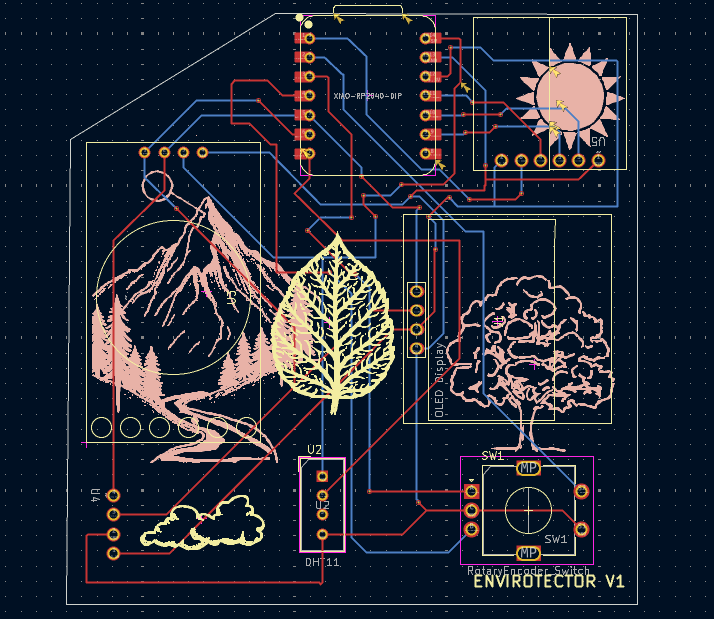

 # Total Design Time: ~30 hours  
 # Total Build Time: ~4 hours

 # Sourcing Components (2/7)

Decided to use a XIAO RP2040 from aliexpress as I have gained some experience with this microcontroller through the hackpad project. For the humidity and temperature sensors I chose the DHT11 as it is chepaer than other options and used often. Originally I built the project using a 0.9 inch OLED display SSD1306 but then changed this to a 1.5 inch 128x128 OLED display. Used a BMP180 air pressure snesor as ive used a similar one before for rocketry projects. All parts were ourced from aliexpress where possible. The DHT11 sensor was sourced from amazon as it worked out cheaper.

time: ~2 hours

# Schematic (3/7)

I used a mixture of the hackpad tutorial and sensor documentation to setup the XIAO connections.I haven't done any pcb design before (other than hackpad) so I had to learn about the footprint editor, symbol editor and importing libraries, making custom symbols for many of the components, this took me a while. The next challenge was that both the OLED display and RTC module are i2c devices but the XIAO only has one SDA pin and one SCL pin. After doing some research i found that it is possible to control multiple i2C devices from the same pins by connecting them in parallel using different i2C addresses. I used datasheets to make sure the footprint pad numbers matched the custom symbol pins and had to experiment with different footprints for each sensor. I also protoryped on a breadboard to test if the connections worked.  
  

time: ~8 hours

# PCB (4/7)

Whilst designing the PCB, I often had to go back and change the symbols and footprints and iterate on the design. When arranging the components I made sure they had lots of clearance and put the sensors close together so that the hole in the case for the DHT11 can provide the ventilation for the BMP180.

time: ~2 hours

# CAD (5/7)
After a lot of trial and error and measurements I relaised I could import the pcb into fusion and use it to cut the holes for the components. I merged the rotary encoder and oled display cutouts to ensure everything fits. I had to restart 3 times so this took a while. I left a slot in the bottom for access to the sd card and xiao so plan to glue the lid to th ebottom (hence no screw holes).

time: ~6 hours

# Firmware (3/7 - 6/7)

This was the hardest part as I can't yet test and properly debug the code. There are probably some issues which I will fix when the actual hardware is built. I used adafruit documentation and various arduino tutorials online. I was able to test the DHT11, RTC and BMP180 code seperatly on an arduino, breadboard prototype but I don't have an OLED display to test on.

time: ~12 hours

# After finishing

I decided I will also solder a 3.7V lipo to the XIAO so it can be portable and added an auto-sleep feature to the screen aswell as a keychain hole. You can wake the screen by pushing in the rotary encoder. I updated the BMP180 footprint and the case to accomadate the breakoutboard rather than just the small component. I also did the same with the microSD card reader, changing it to the breakout board for ease of solderign and simplicity. I also made custom symbols and footprints for these based on the datasheets. I also realised my 3.3V output on the XIAO wasnt connected which has now been fixed. I also rerouted the pcb to ensure that there was a sufficient distance between each of the traces and pads so there aren't any shorts when its printed. Also updated the silkscreen so its not touching any pads or througholes just in case. I also updated the microsd card reader to a smaller footprint.

Summary dates and times:  
2/7 2 hours  
3/7 10 hours  
4/7 8 hours  
5/7 5 hours
6/7 5 hours

# Build ---------------------------------------------------
5/8/25  ~4 hours
Firstly i soldered all the headers to the components and set up a breadboard prototype with all of the components so i could test they workked and make changes to the firmware before soldering everything to the pcb. that way i can also easily tell if something is a component/pcb/software issue. 
    
Spent a while debugging a phhantom i2c address registering at 0x01 and oled not working and eventually realised this was because bmp180 was connected to 5v instead of 3.3v. After finsihing soldering the components to the pcb nothign worked. After some debugging and running an i2c scanner i foudn that none of the devices were registering.
  
I was terrified that this was a pcb issue for a bit but then realised that for some reason the pads on the pcb were reversed compared to the pins on the bmp180 sensor so it was blocking the sda/scl lines. After painfully desoldering it and rerunning the i2c scanner, I got the oled display, rtc and humidity sensor working on the pcb. 
  
Next i resldered the bmp180 backwards and and after confirming everything now works i moved to fusion to redesign the case to accomodate the reveresed bmp180 as it goes over the edge of the pcb now. After a small fix to the wake function of the firmware and some text size changes, the project is working correctly. I then printed the case and test fitted to the pcb. I had to make a few iteratrions of the top case as i dont own calipers os measurements were a bit difficult, but I eventually got a lid that fits the components well. Next I cut the pins on th eback of the pcb so it would fit nicely in the case and glued the lid to the bottom, completing the physical build.
