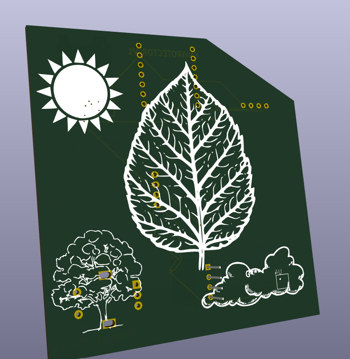

Envirotector is a compact, portable weather station that logs data to an SD card and displays temperature, air pressure and humidity data as well as the time on an OLED display.

Features:  
5 screens (time, temperature, humidity, air pressure, graph) that are navigaated using a rotary encoder  
Saves recorded data to an SD card every 10 minuites for up to 1 week 
Screen automaticlaly sleeps to save power  
The last screen has a graph that displays the sensor readings over time for the last 24 hours.

